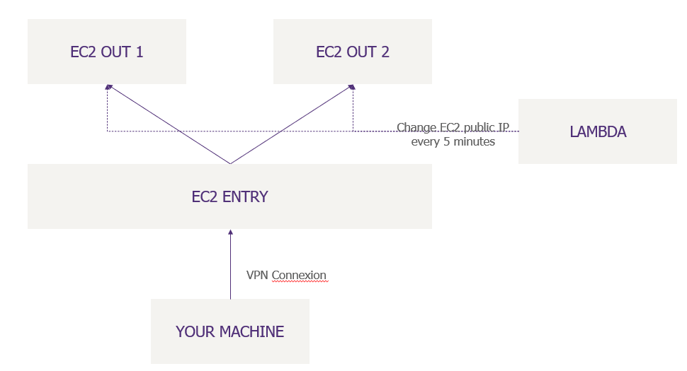

# AWS Roudrobin

AWS infrastructure that help you to change your IP. Every 5 minutes, your output IP will be modified.

Once the setup is complete, you will get an OpenVPN profile.

## Quick setup
0. Set the variables in the terraform.tfvars file
1. Deploy the terraform
2. Copy the host file in the `ansible/inventory/hosts.yml`
5. Set the mandatory variables in `ansible/inventory/readteam.yml`
6. Run the `playbook/roundrobin.yml` playbook
7. Enjoy

## AWS content
This script will deploy the following ressources:
- 3 EC2
- 1 AWS Lambda

The lambda will consume the minimal amount of memory available (125Mo I think).

Enjoy !