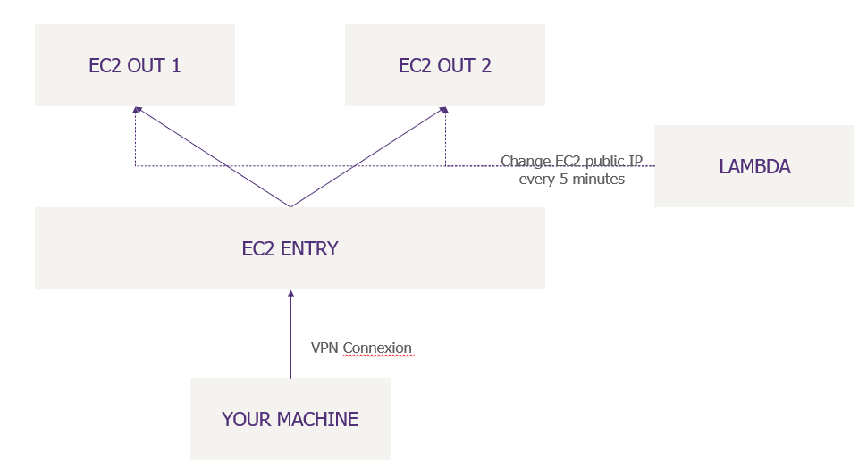

# AWS Roudrobin

AWS infrastructure that help you to change your IP. Every 5 minutes, your output IP will be modified.

Once the setup is complete, you will get an OpenVPN profile.



## Install

```bash
python3 -m venv venv
. venv/bin/activate
pip install -r requirements.txt
ansible-galaxy collection install -r ansible/requirements.yml
```

## Quick setup
0. Set the variables in the terraform.tfvars file
1. Setup credentials using `aws configure`
2. Deploy the terraform
3. Copy the host file in the `ansible/inventory/hosts.yml`
4. Set the mandatory variables in `ansible/inventory/readteam.yml`
5. Run the `playbook/readteam/roundrobin.yml` playbook
6. Enjoy

## AWS content
This script will deploy the following ressources:
- 3 EC2
- 1 AWS Lambda

The lambda will consume the minimal amount of memory available (125Mo I think).

Enjoy !
